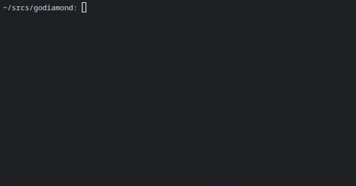

# Go Diamond

## Introduction

Go Diamond is a CLI-tool for interacting with Diamond smart contracts based on the [ERC-2535 standard](https://eips.ethereum.org/EIPS/eip-2535). Built with Go and Foundry, it simplifies the deployment, management, and inspection of Diamond proxy contracts without requiring in-depth knowledge of the standard.  
_The use of Javascript in this project is deliberately avoided by all means._

## Features

1. Deploy: deploy new Diamond contracts with initial facets and function selectors, and handle subsequent deployments of new facets.
2. Cut: add, replace, and remove facets in a Diamond contract. Each facet is associated with a set of function selectors, and altering the facets changes the functions that the Diamond contract can perform.
3. Loupe: inspect a Diamond contract and its facets. It allows you to view the function selectors provided by each facet, check if a specific function selector is supported, and verify if the contract implements a particular interface. 

## Getting Started
Ensure to have Go and Foundry installed and configured.

**Clone the Repository:**
  ```bash
   git clone git@github.com:nvrmndmnm/godiamond.git
   cd godiamond
```

**Install Dependencies:**
  ```bash
go mod download
```

**Build:**
  ```bash
go build -o diamond-cli ./cmd/diamond-cli/
```

**Build contracts:**
  ```bash
forge build --skip script
```

**Config:**

Create a `config.yaml` file (refer to the [config_dev.yaml](config_dev.yaml) template). 

Metadata files are generated by the `forge build` command and by default placed in the `./contracts/out/` directory. This path can be set in the [foundry.toml](foundry.toml) config file.

If the `diamond` has not been deployed yet, you may leave the address field blank. However, note that it's mandatory to provide the address for using the cut and loupe modes.

## Usage
**CLI**
```
Usage:
    diamond-cli deploy [options]
    diamond-cli cut [options]
    diamond-cli loupe [options]

Arguments:
    --rpc <name>                    RPC identifier
    --chain-id <id>                 Chain ID (default: 0)
    -c --config <path>              Load config file (default: "config.yaml")
    -d --debug                      Enable debug mode (default: disabled)
    -h --help                       Show help
```

**Deploy**
```
Commands:
    init                                  Deploy and initialize mandatory Diamond standard contracts
    by-config-id <id> <constructor-args>  Deploy a contract by ID specified in config file
    by-file <path> <constructor-args>     Deploy a contract by specified metadata file path
    help                                  Show help message
    exit                                  Exit the interactive mode

Arguments:
    --id                                  ID of the contract in config file
    --constructor-args                    Comma-separated constructor arguments
    --path                                Path to the contract metadata file
```

Upon each successful deployment, a JSON file created in the `./out/` directory. This file contains the deployment data such as the address, deployer, selectors, etc.

**Cut**
```
Commands:
    add <address> <selectors>      Add a new facet with specified function selectors
    replace <address> <selectors>  Replace selectors of an existing facet
    remove <selectors>             Remove selectors from the diamond
    help                           Show help message
    exit                           Exit the interactive mode

Arguments:
    --address                      Ethereum address of a facet
    --selectors                    Comma-separated function selectors
```
**Loupe**
```
Commands:
    facets                     Show all facets and their selectors
    addresses                  Show all facet addresses used by a diamond
    facet-selectors <address>  Show all function selectors provided by a facet
    facet-address <selector>   Show the facet that supports the given selector
    supports-interface <id>    Show if the contract implements an interface
    help                       Show help message
    exit                       Exit the interactive mode

Arguments:
    --address                  Ethereum address of a facet
    --selector                 Function selector
    --id                       Interface identifier 
```

## Examples

**Deploy – init:**



**Loupe – facets:**


## Testing

Run Go tests:
```bash
go test ./...
```

Run Diamond contract tests with Foundry:
```bash
forge test
```


## About
For more information on Diamonds refer to [Awesome Diamonds](https://github.com/mudgen/awesome-diamonds).  
Big props to [Nick Mudge](https://github.com/mudgen/) for such a beautiful idea and implementation.

Licensed under the [MIT License](LICENSE).